# ⚡ Electricity Billing System

**Tech Stack:** Java | OOPs | JDBC | SQL | Java Swing | AWT | Exception Handling

This is a desktop-based Electricity Billing Management System built using Java Swing. It allows admins to manage customers, meter readings, calculate bills, and more, while customers can view and pay bills.

---

## 📸 Project Output Screenshots

### 🔐 Login Page  
> The main login screen for both admin and customer users.  
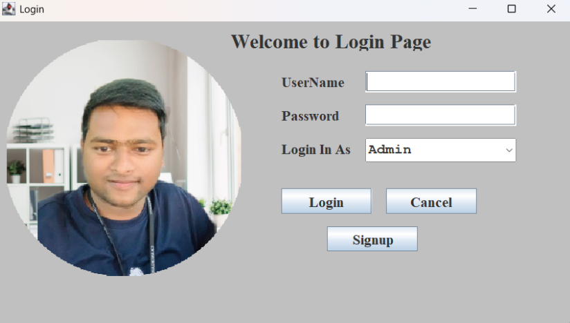

---

### 🖥️ Admin Signup Page  
> Admin registration or first-time login interface.  
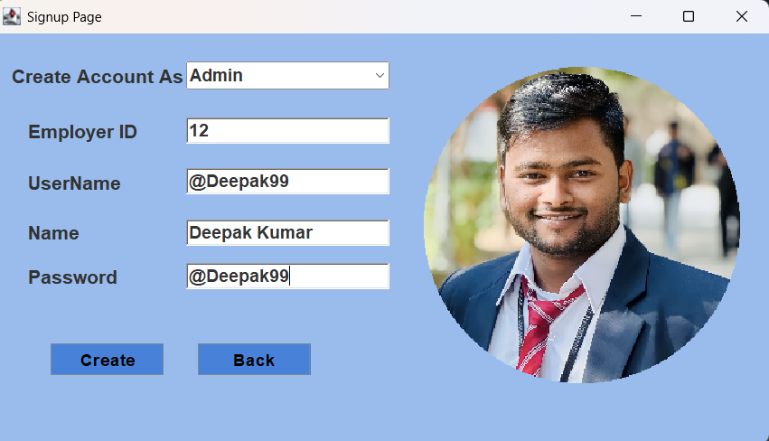

---

### 🛠️ Admin Dashboard / Menu  
> Admin dashboard after login – allows navigation to various admin functionalities.  
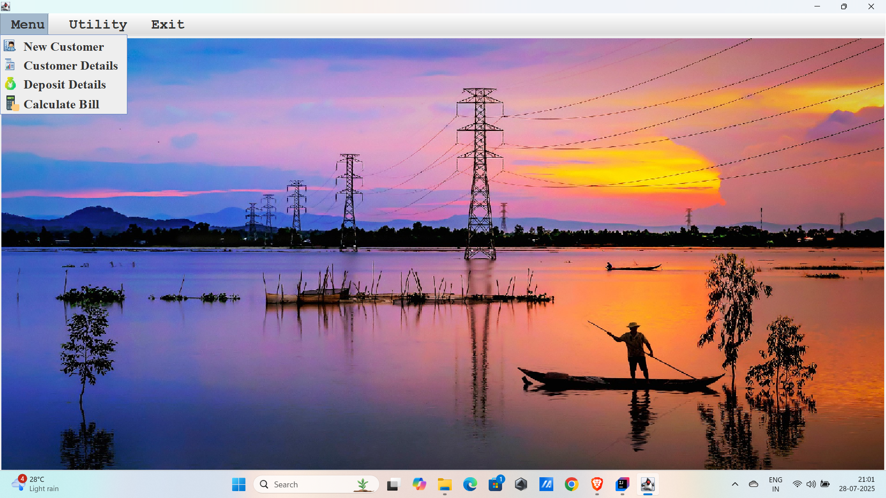

---

### ➕ Add New Customer  
> Admin can add a new customer by entering user details.  

---

### 📈 Meter Information  
> Admin enters or updates the customer's meter details.  
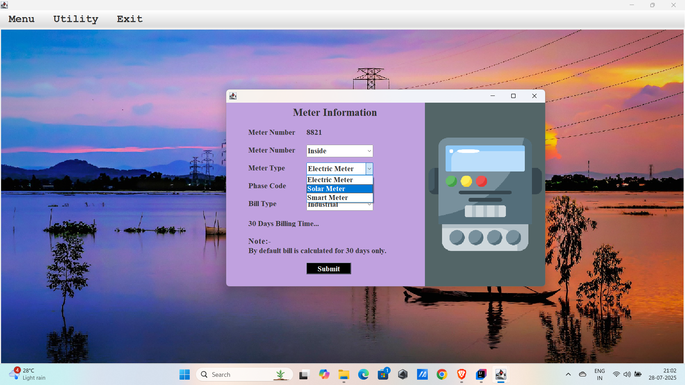

---

### 🧾 Calculate Bill  
> Admin calculates the electricity bill based on meter readings.  
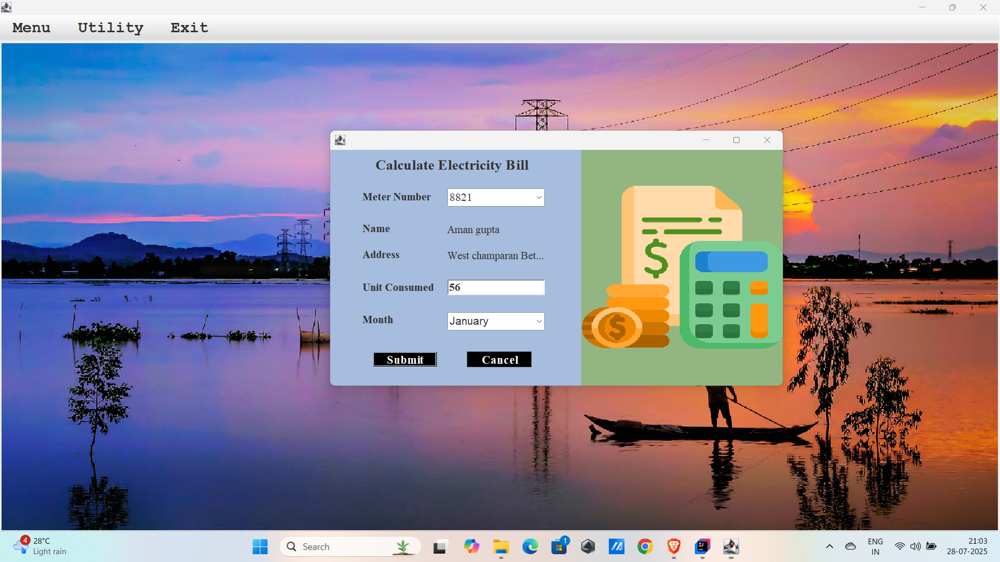

---

### 💳 Deposit Details  
> Shows customer payment and deposit information.  
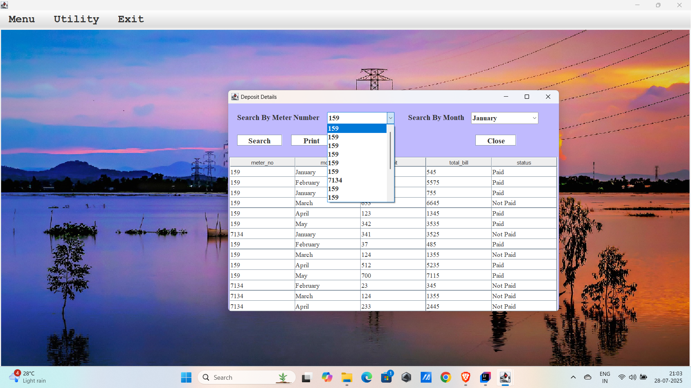

---

### 🔄 Update Customer Information  
> Admin can update existing customer data.  
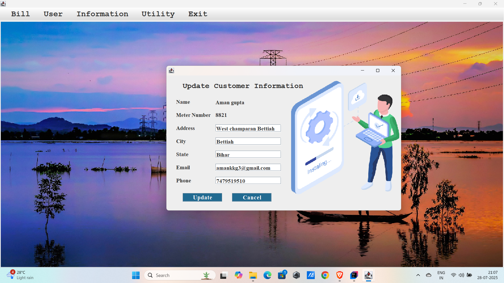

---

### 📄 View Customer Information  
> Displays detailed customer information.  
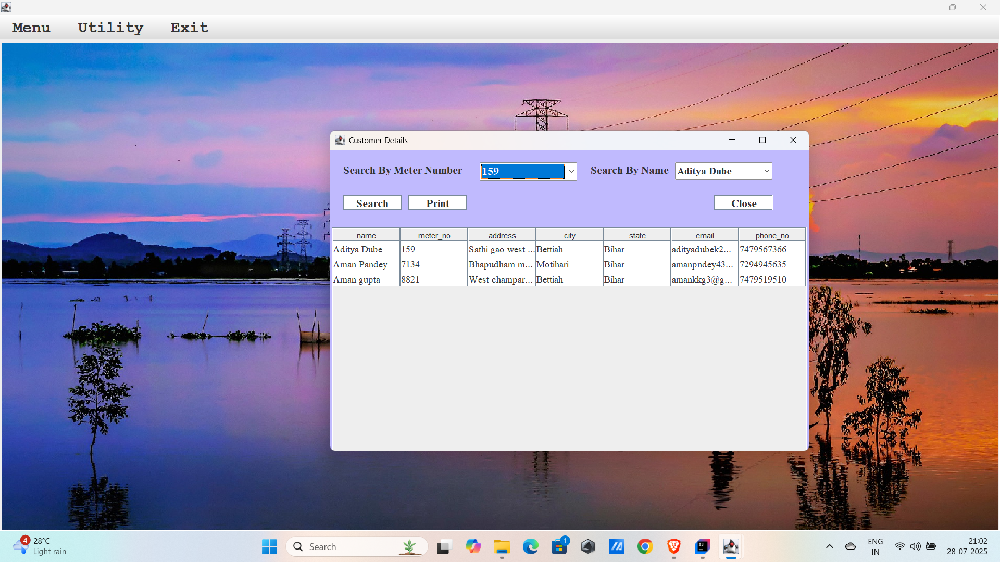

---

### 🧾 Generate Bill  
> Admin can generate the bill for any selected customer.  
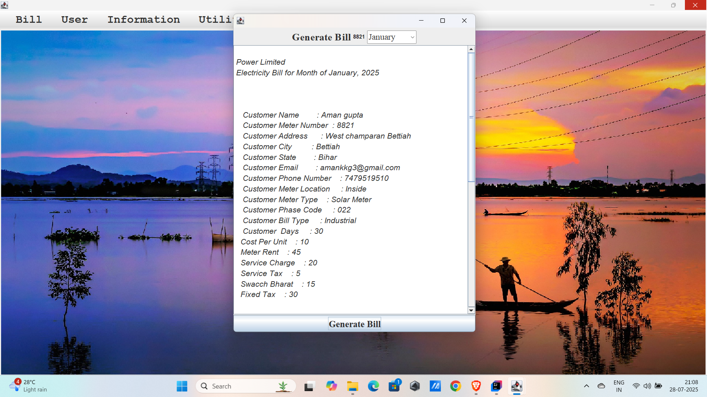

---

### 👤 Customer Menu  
> Menu shown after customer login – access to billing, payment, etc.  
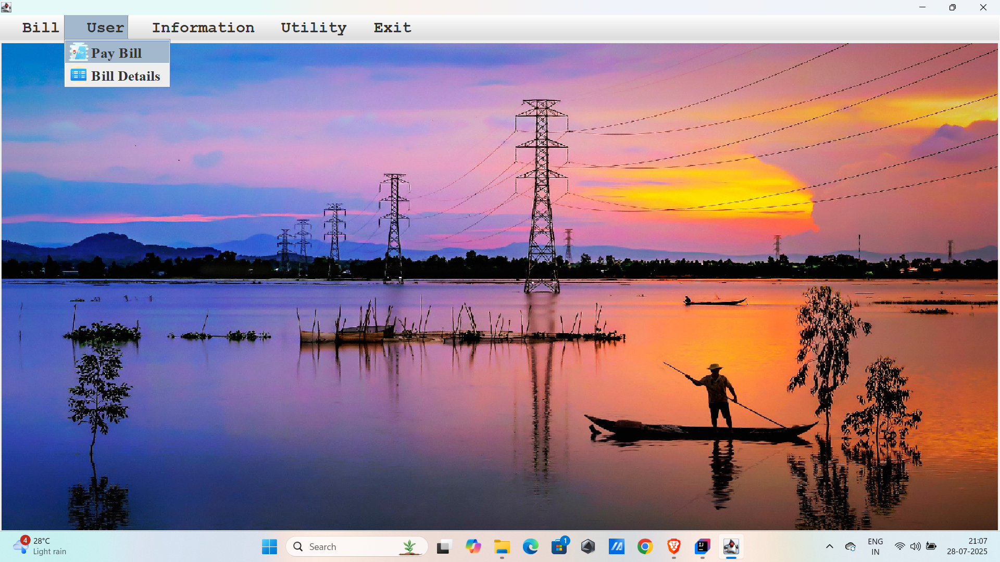

---

### 🧭 Customer Menu (Variant)  
> Alternate layout for customer menu.  
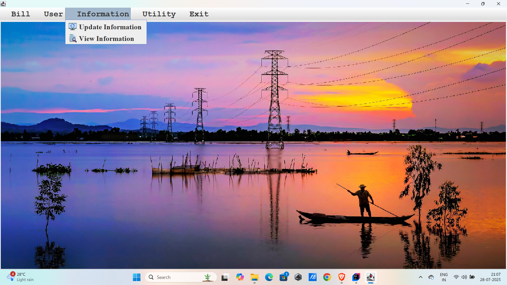

---

### 🧾 Pay Bill  
> Customers can pay their pending bills using this interface.  
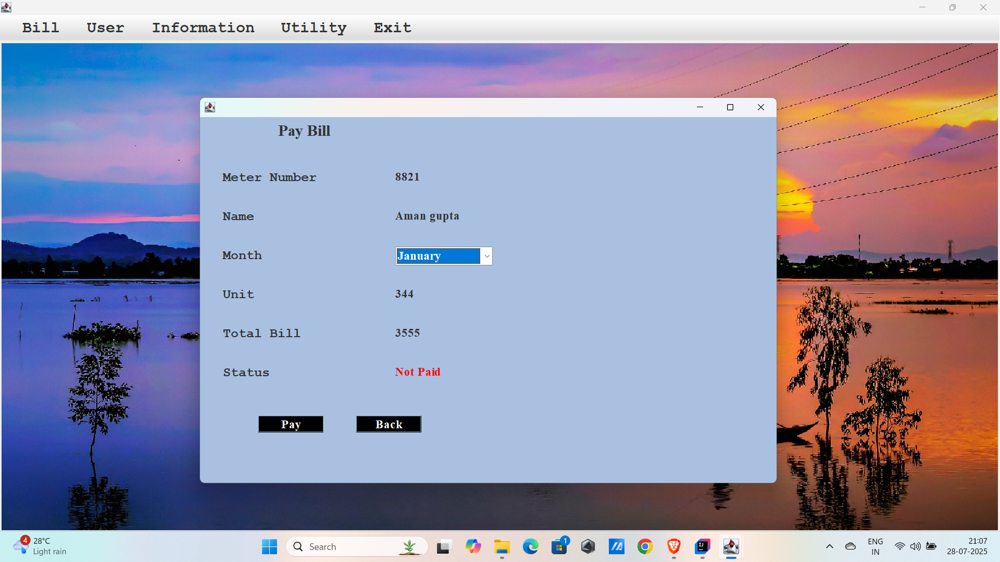

---

## 🚀 Features

- Admin & Customer Login
- Add and View Customers
- Meter Reading and Bill Calculation
- Pay Bills (Customer Side)
- Deposit and Payment Tracking
- GUI with Java Swing and AWT
